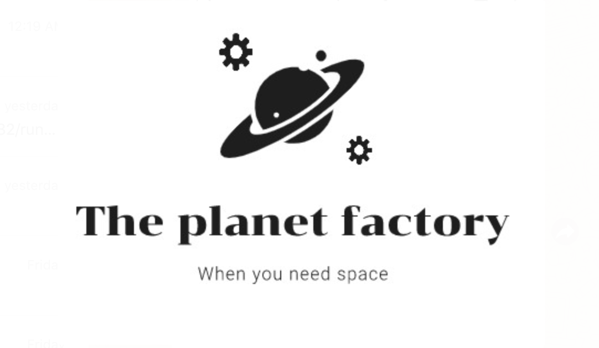

# The Planet Factory

Our challenge submission for NASA SpaceApps in Enschede 2019.

The Project was built by:
- Matthijs Aannen 
- Sebastian Bunda
- Emmanouela Katzouraki
- Antonis Katzourakis
- Melissa Tijink

The project page with more information is located here: 
<https://2019.spaceappschallenge.org/challenges/planets-near-and-far/build-planet-workshop/teams/beun-team-twente/project>

#### Video Demo
Click to view:

#### Machine Learning scripts and possible issues
The Processing GUI calls a Python script which loads the Machine-learning classifier. It needs the absolute path to the Python binary (*system-dependent*). 

Also, a classifier saved using Pickle on MacOS might fail to load on Windows, then you can train a new classifier by changing the `train_data_from_scratch` to `True`. When you run the script again it will first train and save the new model, then classify the given planet.